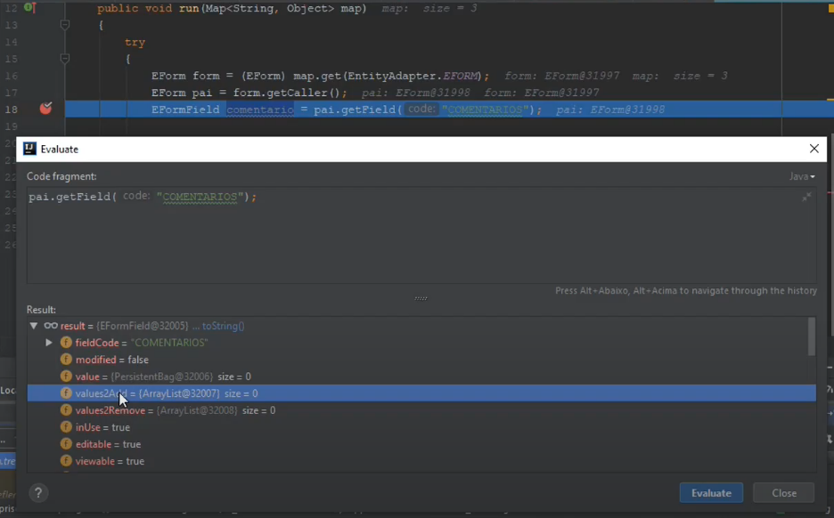
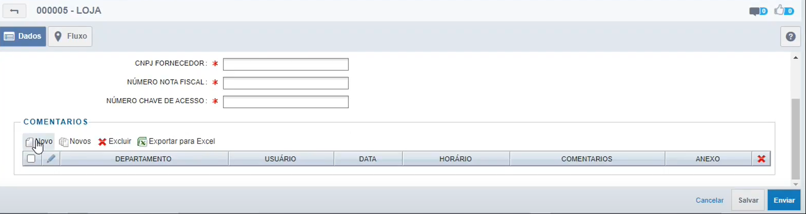
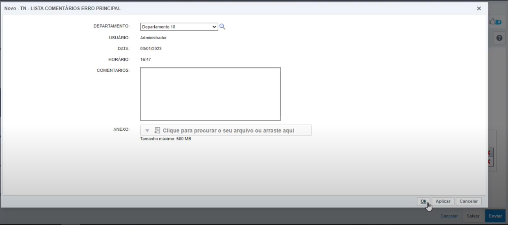
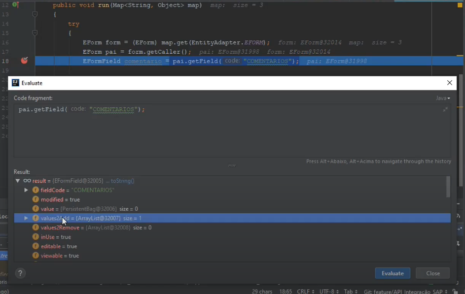

# Operações importantes

A partir do momento em que o formulário onde o *Adapter* está inserido foi salvo em um Objeto do tipo *EForm* podemos obter o formulário principal através do método *getCaller()*.

```java
   EForm form = (EForm) map.get(EntityAdapter.EFORM);

   EForm formularioPrincipal = form.getCaller();
```
*Buscando o formulário principal*

## Acessando o formulário principal

Com acesso ao formulário principal, temos acesso ao que já está persistido no banco de dados e, com o formulário onde o *Adapter* está inserido, temos acesso aos registros que pretende-se persistir. 

Para isso podemos utilizar os métodos **getValue()** para acessar o que já está persistido e **getValues2Add()** para ter acesso ao que foi inserido porém ainda não persistido em banco.

Há também o método **getValues2Remove()** que tem funcionamento semelhante ao getValues2Add() porém identifica os valores que, assim que persistidos, não existirão mais no banco de dados.

As imagens a seguir exemplificam o caso onde o *Adapter* está em um formulário que é chamado pelo formulário principal. No formulário do *Adapter* será inserido um registro e será verificado onde o mesmo se encontra.


*Evaluate no campo onde será inserido.*


*Adicionando primeiro registro ao formulário onde encontra-se o Adapter.*


*Dando Ok para adicionar o registro.*

Ao adicionar outro registro e realizar o evaluate no campo onde será inserido o registro poderemos observar o seguinte: 


*Verificando os registros inseridos.*

No evaluate tem-se agora o valor *values2Add = 1* referente ao primeiro registro que foi inserido. Irá valer 2 assim que sair do modo *debbug* no *Intellij*. E *value* irá valer 2 quando a atividade for enviada.

Por exemplo, caso nosso objetivo fosse que o departamento 10 pudesse fazer apenas um comentário, nosso código ficaria da seguinte forma:

```java
public void run (Map <String, Object> map)
{
    try
    {
        EForm form = (EForm) map.get(EntityAdapter.EFORM);
        EForm pai = form.getCaller();
        EFormField comentario = pai.getField("COMENTARIOS");
        Collection \<NeoObject\> collection = comentario.getValues2Add();
        for (NeoObject coll : collection){
            EntityWrapper wColl = new EntityWrapper(coll);
            Long codigo = wColl.findGenericValue("codigoDoDepartamento");
            if(codigo == 10L){
                throw new WorkflowException ("Já foi inserido um comentário do departamento 10");
            }
        }
    }catch (WorkflowException e){
        e.printStackTrace();
        throw e;
    }
}
```
Importante salientar que essa lógica não considera o caso de que um ou mais comentários já poderiam estar inseridos. Para manipular esses valores inseridos anteriormente utiliza-se o método **getValues()**;

No nosso exemplo acima, caso tivéssemos registros anteriores teríamos acesso aos mesmos através da seguinte operação:

```java
    List \<NeoObject\> registrosAnteriores = (List\<NeoObject\>)comentario.getValue();
```

