# Converter

## O que é um converter
Um converter é um adapter que trata de alterações feitas em tempo de execução, não sendo necessário avançar uma atividade para realizar alguma alteração. Os converters utilizam JavaScript para a manipulação do front-End.

## Formulário exemplo
Para verificarmos o funcionamento do converter, primeiramente será necessário a criação de um formulário, não é necessário atrelar esse formulário a um processo, pois o converter é executado em **tempo de tela**.

- Crie um formulário dinâmico com o título **Testes Converter**.

- Crie os campos ***Valor 1, Valor 2 e Resultado***, todos do tipo **Número Decimal**.

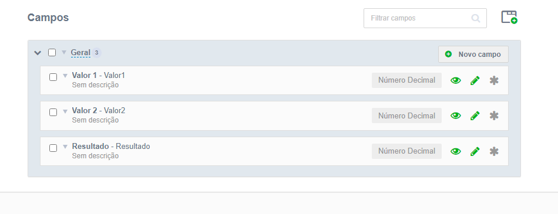

Para acessarmos o formulário criado, vá em central de formulários, encontre o seu formulário e selecione exibir registros.

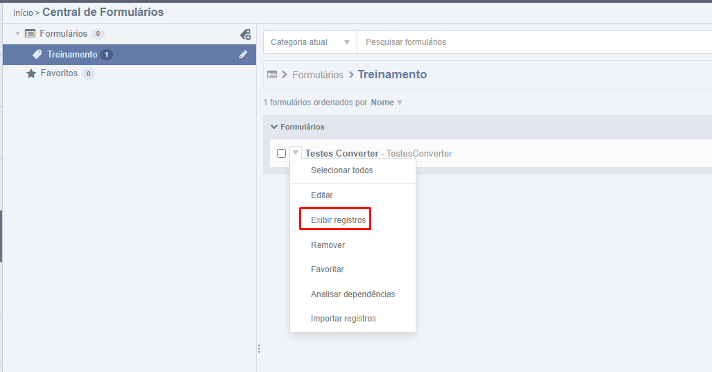

Após, crie um novo registro.

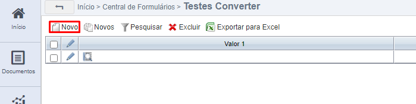

Teremos então a seguinte tela:

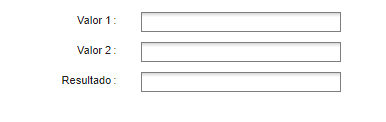

Nosso objetivo é, assim que o usuário preencha os 2 primeiros valores, seja calculado a soma desses dois valores, e inserido o resultado no campo '*Resultado*'.

## Como implementar um converter

Os campos de insersão dos converters são dentro do próprio campo do formulário, por exemplo:

Então, vamos a nossa classe Java.

- Crie a classe java chamada ***PrimeiroConverter***.

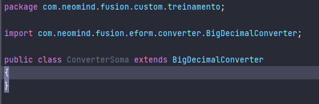

- Extenda a classe *BigDecimalConverter*

!!! Info
    E por que extender *BigDecimalConverter*? Porque o campo que será inserido o converter (Resultado) é um campo do tipo **Número Decimal**, caso fosse um campo do tipo texto, extenderia *StringConverter*, Long, *LongConverter*. A título de curiosidade, essas são as classes "*Converters*", mas 99% das vezes, os converters que serão utilizados são os tipos mais comuns de campos dos formulários, como *GregorianCalendarConverter*, *BooleanConverter*, e os mencionados acima.

    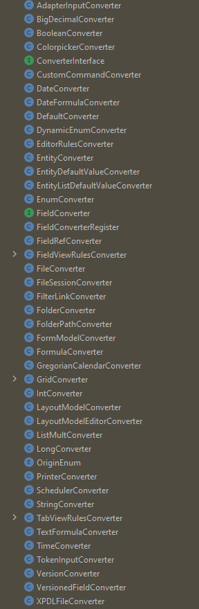

Como extendemos a classe *BigDecimalConverter*, vamos utilizar 2 de seus métodos, utilizando a sua IDE:

- Clique com o botão direito em cima da classe que extendemos.
- Clique em *Generate*.

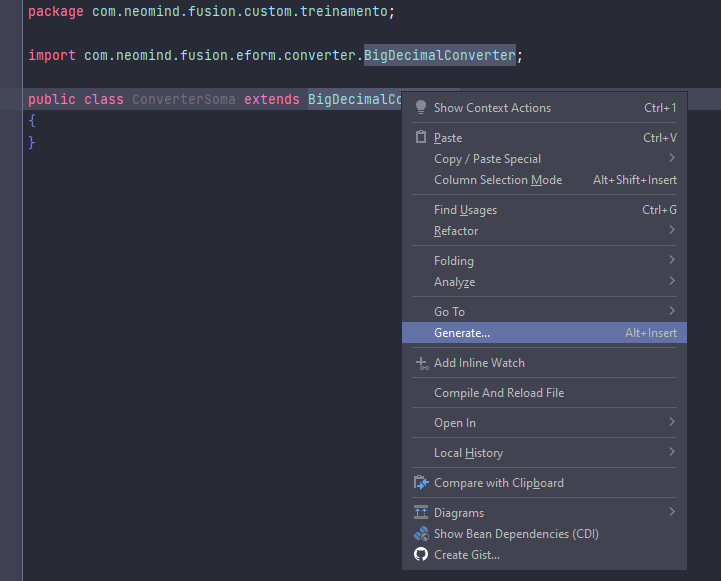

- Em seguida em *Override Methods*.
- Selecione então os métodos *GetHTMLInput* e *GetHTMLView*

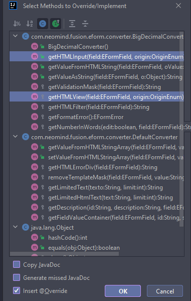

Observe que trouxemos 2 métodos para nossa classe.

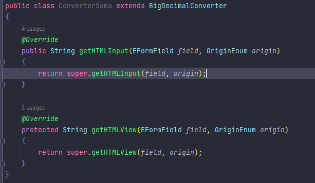

- *GetHTMLInput*: É utilizado quanto nosso campo está como editável em nosso formulário.
- *GetHTMLView*: É utilizado quando nosso campo está como visualizável apenas.

Como nosso campo resultado está como editável, vamos utilizar apenas o *GetHTMLInput* por hora, então, vamos analisá-lo.

## GetHTMLInput

O método *GetHTMLInput* possui:

- Primeiro parâmetro *EformField Field*: Nada mais é que o campo do formulário que foi inserido o Adapter.
- Segundo parâmetro *OriginEnum origin*: Não vamos entrar a fundo no momento.
- Retorno: Perceba que o tipo do retorno é uma *String*, por padrão, quando extendido o método, é trazido o retorno padrão do método da classe BigDecimalConverter, este retorno é um ***HTML***, ou seja, caso queira criar botões, manipular o JavaScript, css, ou qualquer coisa relacionada ao frontEnd desse formulário, isso é possível ao concatenar ao retorno padrão do método.

Para começarmos nossos testes, primeiramente vamos inserir o caminho da classe java no campo de adapters de conversão no campo resultado do nosso formulário.

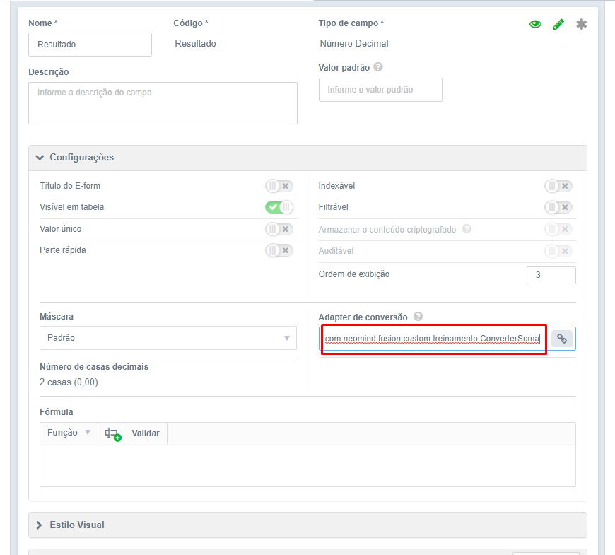

Agora, para visualizar o funcionamento do método ***GetHTMLInput***, adicione a classe:

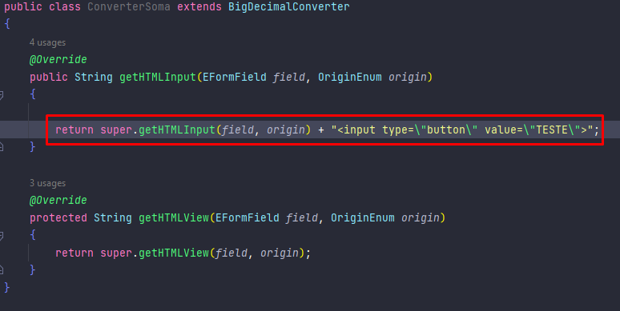

Observer que foi concatenada uma tag *HTML* para a inserção de um botão. Agora vamos visualizar no formulário.

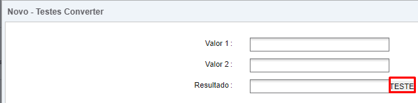

Agora imagine que fosse necessário escrever uma grande quantidade de código, seria dificultosa a leitura e escrita da classe se tivessemos que escrever tudo isso concatenado no retorno da nossa classe. Dessa necessidade surge o ***VelocityUtils.runTemplate***.

## VelocityUtils.runTemplate()

O método *runTemplate* da classe *VelocityUtils* trazer tags *HTML* concatenadas para o nosso retorno, porém, de uma forma de melhor visualização, para isso, é necessário especificar o caminho de um "template", que conterá o conteúdo *HTML* desejado.

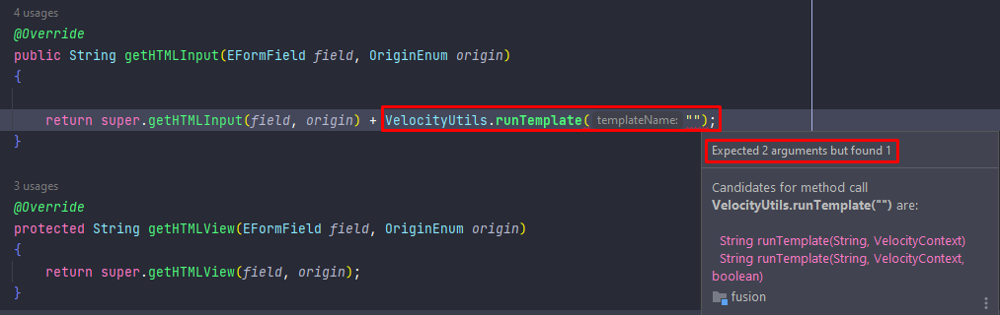

- Perceba que a IDE acusa que o método *runTemplate* recebe 2 argumentos, uma string (que é o caminho para o template), e um objeto ***VelocityContext***, que é um hashMap, em que a **chave** é o **nome** de uma variável que será enviada ao front-End, e o **valor** o **valor** dessa variável.

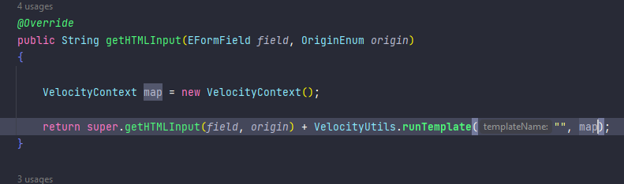

### Criação do template

Não são apresentados erros na IDE, mas se executada essa classe, será estourada uma excessão de *FileNotFound*, pois no primeiro argumento não foi passado um caminho válido para nosso template. Então vamos cria-lo.

- O diretório "raiz" em que é procurado o template é na pasta ***webui***, porém, como boa prática de organização de arquivos, vamos criar dentro de ***webui*** uma pasta com o nome de ***vms***, e dentro desta pasta alocaremos nossos templates.

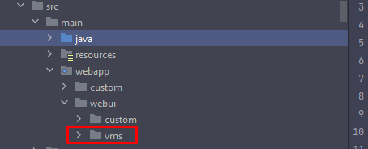

- Dentro desse diretório, iremos criar nosso template chamado **ConverterSoma.vm**.

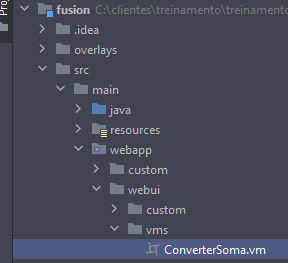

!!! warning
    É necessário que a extensão do arquivo seja "**.vm**".

Vamos então transferir o código de criação de botão para o arquivo **ConverterSoma.vm**.

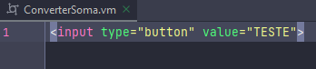

Em seguida, adicionar o caminho do template ao método ***runTemplate***.

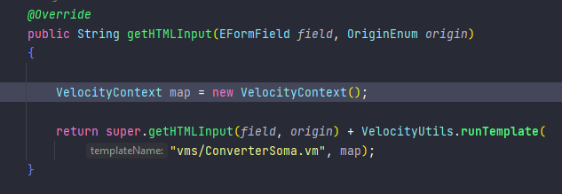

Ao abrir novamente os registros, é possível verificar que nada foi alterado, pois o método **runTemplate**, tem o mesmo efeito que concatenar ao final do retorno da classe, porem, é mais organizado e legível.

### Utilizando JavaScript

Vamos agora implementar uma função JavaScript que, ao clicar no botão *Teste*, é feito o calculo da soma dos valores dos campos *Valor 1* e *Valor 2*.

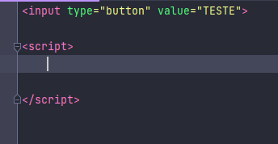

Criamos uma tag *Script* dentro de nosso arquivo .vm, que será adicionada ao conteúdo da página web, mas como descobrir o valor dos campos do formulário?

- Aperte F12 no seu teclado ou clique com o botão direito enquanto estiver na tela do formulário, entrando no modo "inspecionar elemento" do navegador.
- Clique no ícone de *seleção de elemento* da área de inspeção de elemento.

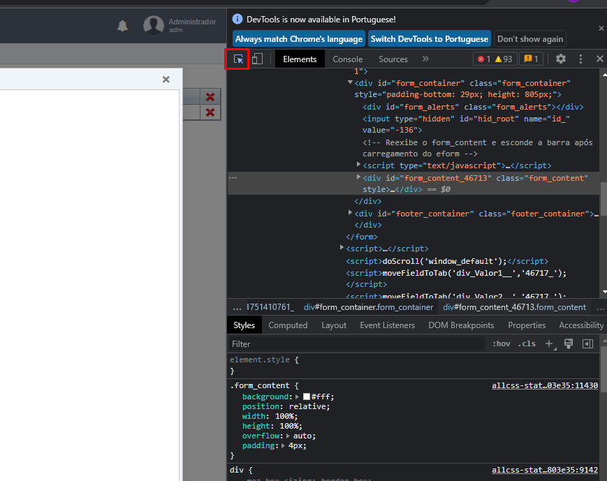

- Clique no campo de *Valor 1*.
- Então será possível visualizar todos os atributos *HTML* do campo selecionado. O atributo que usaremos para pegar o valor em tempo real do campo será seu ID.

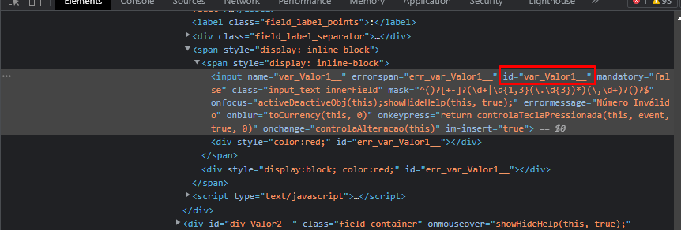

Com o ID podemos trazer o valor do campo com JavaScript puro ou com JQuery.

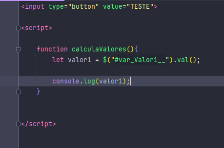

Agora que criada a função, precisamos que ela seja chamada de alguma forma. Utilizaremos o atributo "*OnClick*" no botão TESTE para chamar a função calcula valores.
Porém, da maneira que está, o botão chamaria a função antes que a função seja criada, sendo assim, primeiro criaremos a função, depois a chamamos no botão.

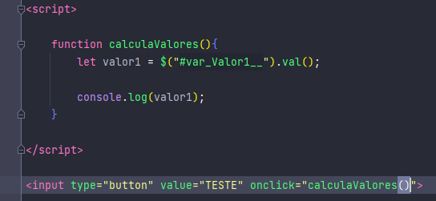

Se nosso converter estiver funcionando como o previsto, será printado o valor no console do navegador.

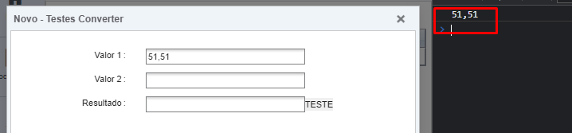

Vamos agora então criar a versão final de nossa função JavaScript.

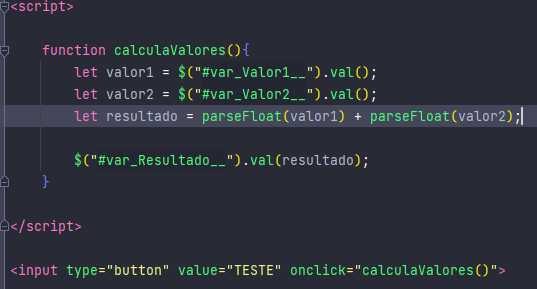

E seu funcionamento.

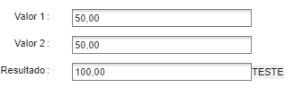