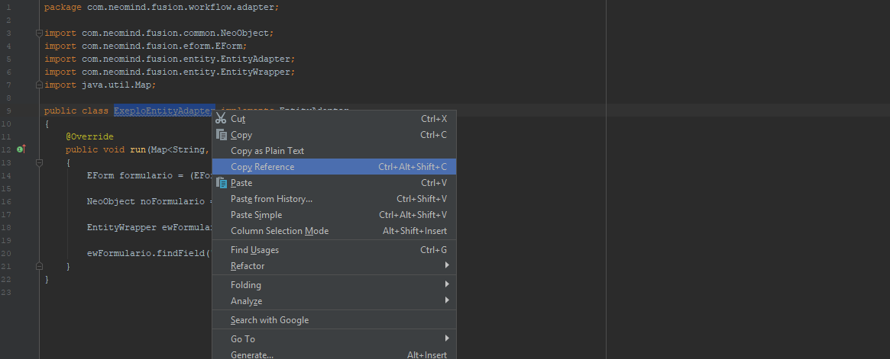

# Como Usar os Activity Event Finish Listeners

Os *Activity Event Finish Listeners* são feitos com classes Java que implementam a interface *Activity Event Finish Listener*. 

## 1. Onde encontrar o caminho da classe Java

- No Eclipse seleciona o nome da classe, clique com o botao direito e vá em **Copy Qualified Name**.


*Como obter caminho Java no Eclipse.*

- No IntelliJ seleciona o nome da classe, clique com o botao direito e vá em **Copy reference**.


*Como obter caminho Java no IntelliJ.*

## 2. Parâmetros do Adapter

*ActivityEventFinishListener* é uma interface e por isso devemos implementar seus métodos. Nesse caso a interface possui apenas um, o método **onFinish()**. 

Este método tem como parâmetro um objeto da classe **ActivityEvent**. Essa classe tem recursos para mapear os acontecimentos de um evento.

## 3. Como iniciar a classe Java

Assim se cria a classe Java responsável pela execução da lógica que irá se construir com este *Adapter*:

```java

    public class ExemploDeActivityListener implements ActivityFinishEventListener
{
	@Override
	public void onFinish(ActivityEvent activityEvent) throws ActivityException
	{

	}
}
```
