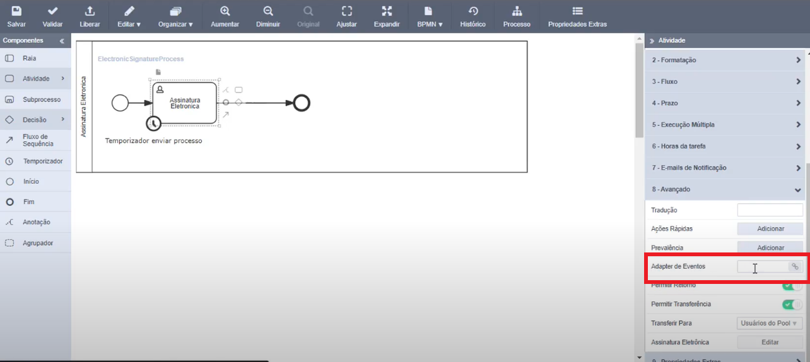

# Adapters de Formulário

## 1. Escolha da utilização de um ActivityEventFinishListener

A escolha de utilizar o *Activity Event Finish Listener* se dá quando é necessária **realizar uma validação na finalização de uma atividade**. 

Esse adapter é vinculado com a atividade do processo e é executado quando o usuário envia a atividade.

## 2. Onde configurar um ActivityEventFinishListener

Os *Activity Event Finish Listeners* são inseridos dentro das atividades do processo. Para isso, na modelagem do processo, basta clicar na atividade para abrir seu menu. No item **8 - Avançado** há o campo *Adapter de Eventos*, onde é inserido o caminho de uma Classe Java 

*Local onde deve ser inserido o Activity Event Finish Listener.*