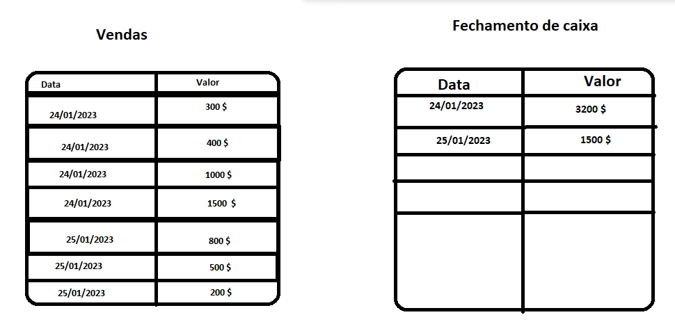

E como exercício desafio do nosso módulo de job, você terá que fazer o seguinte:

Criar um novo formulário chamado **Vendas** onde terá três campos:

- Código: do tipo inteiro.
- Data: do tipo data.
- Valor: do tipo decimal.

Um outro formulário chamado **Fechamento caixa** onde terá dois campos:

- Data: do tipo data.
- Valor: do tipo decimal.

Agora com os form criados, o nosso exercício será pegar todas as vendas realizadas em um determinado dia e registrar no fechamento de caixa o total que foi vendido naquele dia.

Veja um exemplo graficamente para entender melhor.

Foram realizadas 4 vendas no dia 24/01/2023 e no dia 25/01/2023 foram 3. No fechamento de caixa deverá ser somada todas as vendas do dia 24, que irá totalizar em 3200 $ e registrado. O mesmo vale para os demais dias.

**O fechamento de caixa deverá ser feito por uma Job!!!**

!!! Observação
    Não é necessário criar nenhum processo novo, você pode inserir registros e visualizar pelos próprios formulários.