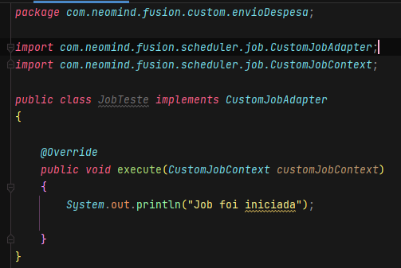
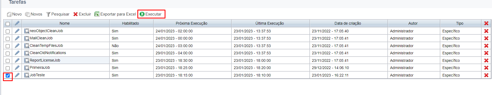
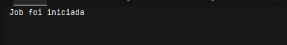
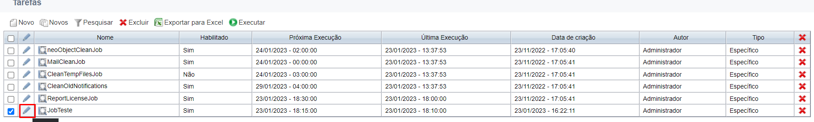
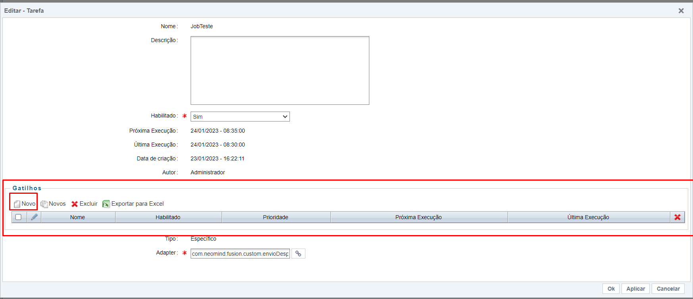
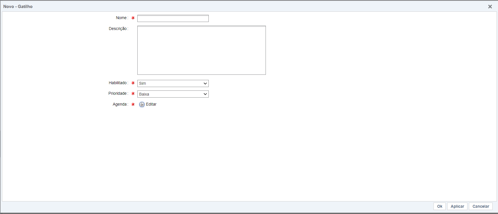
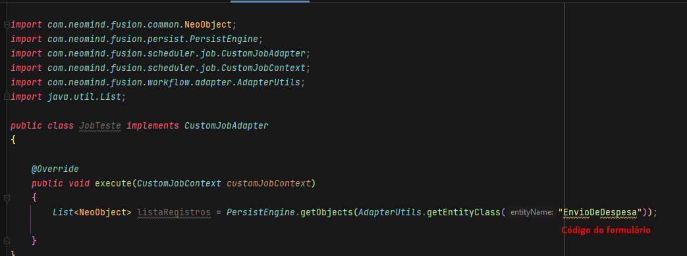
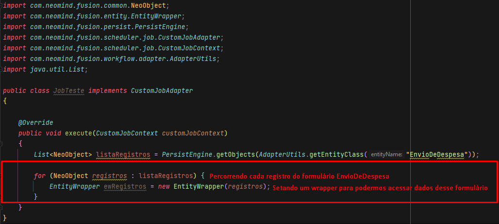
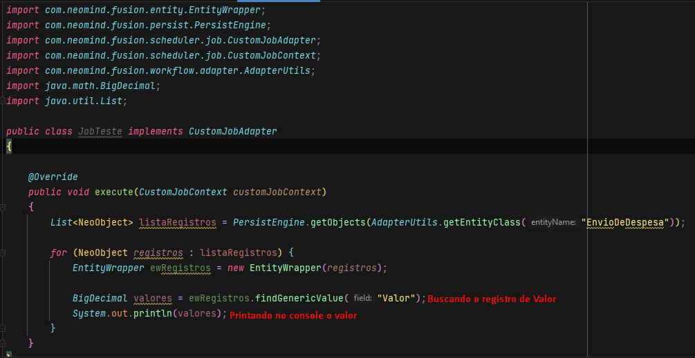
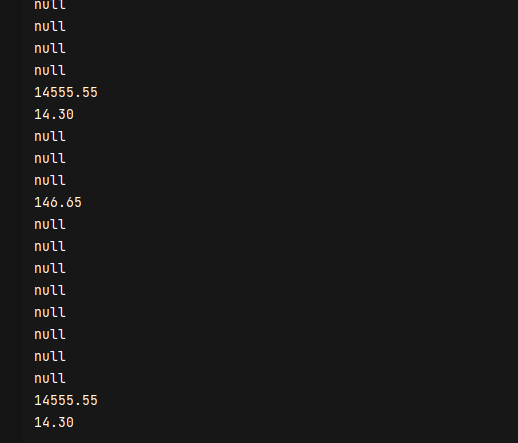

## 1. Iniciando alguns processos

A primeira coisa que você deverá fazer é iniciar e terminar por completo alguns processos de **Envio de despesa**, isso vai nos ajudar na visualização da resposta da nossa job.

## 2. Programando a Job

Após feitos alguns processos, vamos codar.

Dentro de uma job, somos livres para fazermos o que bem entender, desde pegar dados de formulários, processos, coisas padrão do Fusion e mais uma infinidade de coisas, ou seja, o céu é o limite. 

### 2.1 Printando uma mensagem no console atráves de uma Job

Para o nosso primeiro passo vamos fazer algo bem simples, como por exemplo, aparecer uma simples mensagem no *console* quando iniciarmos nossa Job.

Para printarmos algo no console precisaremos utilizar o famoso *System.out.println()* onde dentro dos parenteses iremos escrever alguma mensagem no formato string.

O código irá ficar dessa forma.

Agora para executarmos nossa job, precisaremos voltar de novo ao *Fusion* onde lá há duas formas que nossa job pode ser executada

### 2.2 Forma de executar uma job.

#### 2.2.1 Executando ela

Essa é a mais simples forma de execução de uma job, porém o único defeito dela é que ela tem que ser feita manualmente, ou seja, cada vez que quisermos iniciar essa job, vai ser feito de forma manual.

Para executar, basta a gente selecionar nossa *job* na caixa onde há um checkbox e em seguida procurar pelo botão **Executar** que está um pouco acima da lista de job.

E por fim a job será executada e você poderá ter esse retorno no seu console:

[Job não rodou? Veja aqui.](questions-job.md)

#### 2.2.2 Através de gatilhos

E há mais uma forma de executar uma job, e é através de gatilhos, onde podemos configurar para que essa job possa acontecer de minutos em minutos, horas, dias, semanalmente e por ai vai. A intenção é que com isso possamos ser mais fiéis a rotinas e fugir da forma manual de executar as jobs.

Para ativar o gatilho, basta clicar no *lápis* no registro em que sua job está.

Em seguida irá abrir uma tela, onde podemos modificar algumas informações sobre a nossa job, e dentro dessa janela há um campo do tipo lista chamado **Gatilho**, é nele que vamos adicionar nosso gatilho, então clique em **Novo**.

Após clicar em novo irá abrir uma nova tela que é onde vamos configurar nosso gatilho. Dentro das configurações há algumas informações que devemos preencher para que o funcionamento do gatilho possa funcionar.

<ul>
<li><strong>Nome: </strong>Aqui iremos dar um nome ao nosso gatilho. Pode ser qualquer um, mas tente dar um nome semelhante ao nome da sua job.</li>
<li><strong>Habilitado: </strong>Iremos marcar habilitado para que nosso gatilho possa funcionar, e caso precisarmos desabilitar, basta trocar a opção.</li>
<li><strong>Prioridade: </strong>Nesse campo iremos definir a prioridade, sendo possível escolher 3 níveis de prioridade: baixo, médio, alta.</li>
<li><strong>Agenda: </strong>Essa é a parte mais fundamental da configuração do gatilho, pois é aqui iremos definir de quanto em quanto que nossa job deverá ser executada.</li>
</ul>

Após preencher as informações basta clicar em **Ok**. Note que depois do tempo determinado e caso você tenha marcado o campo **Habilitado** a sua job irá ser executada.

!!! info
    É necessário reiniciar o ambiente após a criação da job para funcionar.

[Job não rodou? Veja aqui.](questions-job.md)

### 2.3 Exemplo - Printando informações de um formulário

Como uma job não está diretamente ligada a um formulário, nós precisamos buscar essas informações atráves do nosso **Banco de dados**. Se vocês se lembrarem bem no [Módulo III](../module-3/get-objects-database/get-objects-database.md) fizemos algo parecido de pegar valores diretamente no nosso banco e usar em algum dos nossos adapters.

Vamos seguir essa lógica de pegar informações diretamente do banco, para que possamos usar dentro da nossa Job.

Lembram que no inicio dessa seção eu pedi para que executassem algumas vezes o processo de **Envio de despesa**? Então, iremos usar esses novos registros para printar todos os valores que foram registrados.

Inicialmente vamos buscar os registros do nosso formulário no banco com o codigo a seguir:

Em seguida precisaremos percorrer os registros um por um e logo após criar um EntityWrapper para que possamos buscar informações dentro dos registros.

Agora que temos o wrapper setado, vamos buscar o registros de **Valores** e printar na tela.

O resultado no nosso console será representando por alguns valores que virão dos nossos registros e pode acontecer de vir alguns registro como *null* mas fique tranquilo, isso é porque alguns dos seus registros nesse formulário são nulos.

Resultado do meu console:

Com esse pequeno exemplo da para ver que quando se trata de uma job, podemos fazer o que quisermos e lembrando que a usabilidade da job vai depender de cada cenário.

[Exercício desafio](exercise.md)