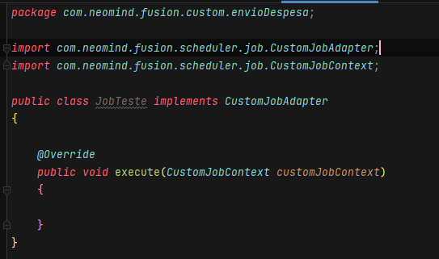
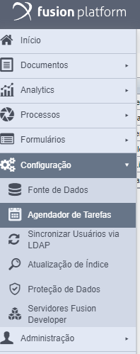
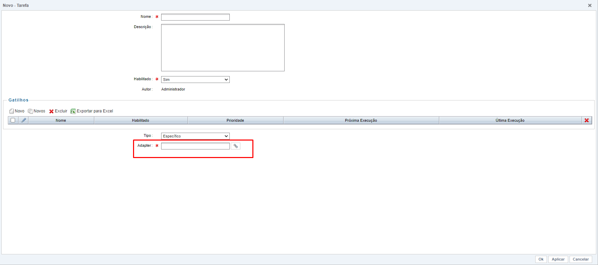

## 1. Criando classe Java
Inicialmente para criarmos nossa job, precisaremos ir até nossa IDE de desenvolvimento e criar uma nova classe com o nome **JobTeste**.

Em seguida devemos implementar a classe **CustomJobAdapter** e implementar o método *execute()* para podermos continuar.

## 2. Criando job no fusion

Agora para criarmos nossa job de fato, precisaremos navegar pelo nosso menu e ir até  **Configuração > Agendador de Tarefas**.

Após isto, ele irá abrir uma nova tela, onde será possível ver algumas jobs já existentes.
!!! info
    Essas jobs que estão presentes na tela, são padrão do Fusion.
Essa é a tela que irá aparecer:

Em seguida para darmos continuidade, clique na opção de **Novo** onde de fato iremos criar e configurar nosso adapter dentro do Fusion.

Agora preencha as informações que estão marcadas como **Obrigatórias**, principalmente onde devemos colocar o path da nossa classe Java nova criada.

Para saber como preencher os campos no agendador de tarefas, consulte a documentação oficial do fusion:

[Agendador de Tarefas | Fusion Docs (neomind.com.br)](https://docs.pages.neomind.com.br/central-de-ajuda/docs/configuracao/agendadordetarefas/)
   
[Programando uma job](how-to-code-job.md)
